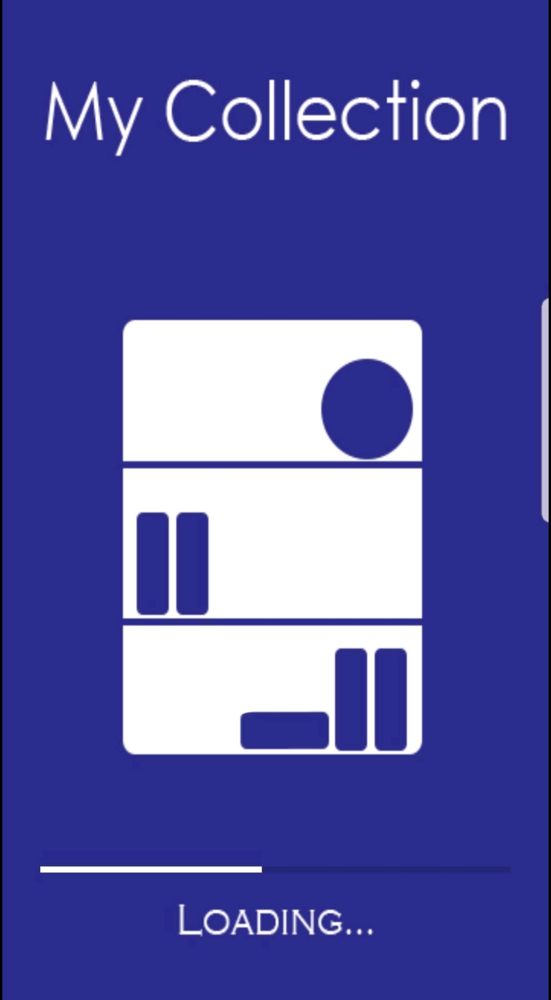
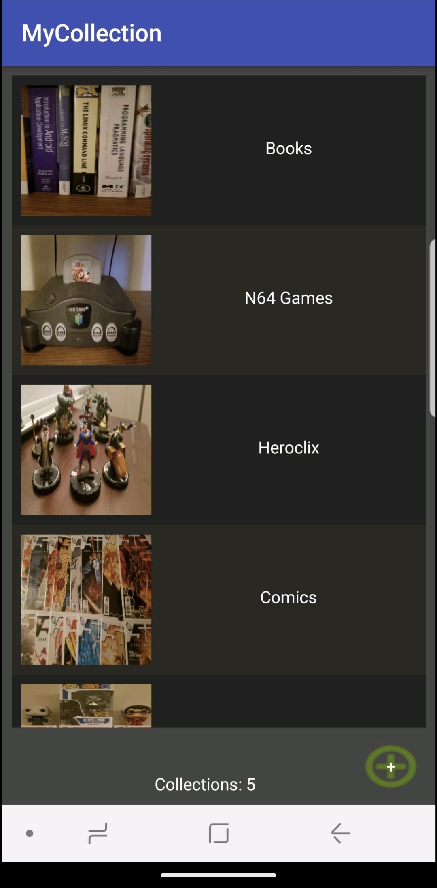
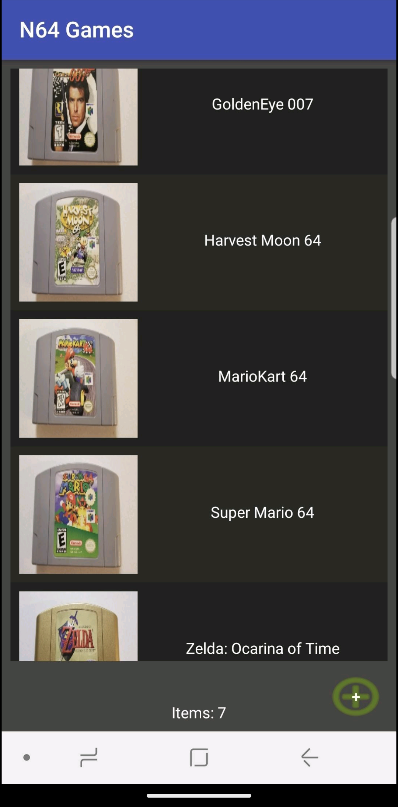
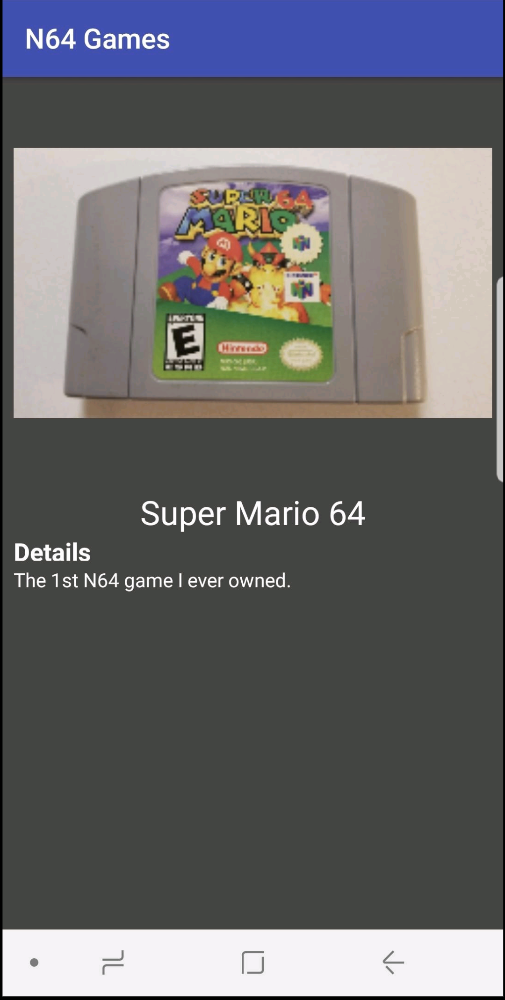

<!--
**DHargett32/DHargett32** is a ✨ _special_ ✨ repository because its `README.md` (this file) appears on your GitHub profile.

Here are some ideas to get you started:

- 🔭 I’m currently working on ...
- 🌱 I’m currently learning ...
- 👯 I’m looking to collaborate on ...
- 🤔 I’m looking for help with ...
- 💬 Ask me about ...
- 📫 How to reach me: ...
- 😄 Pronouns: ...
- ⚡ Fun fact: ...
-->

<head>
    <link rel="stylesheet" href="https://kit.fontawesome.com/f0a6d108e3.css" crossorigin="anonymous">
</head>

# Dylan

Hello! I'm Dylan. I'm a software developer with over 9 years professional experience. Here you can find a variety of projects/ assignments that I have used to develop my skills and understanding of different languages, frameworks, and concepts. I'm always learning something new and enjoy building exciting projects!

## 🧰 Languages and Tools
Here are some of the tools and languages that I have experience with.

    
     
     
    
    
    
    
    
    
     
        

<!-- ## 📚 Projects
The following is a list of complete projects that I have developed:

<ul>
    <li>
        

            <h1>My Collection<h1>
            
            
            
            
        

    </li>
</ul> -->

## 🌱 I’m currently learning
I'm currently learning:
<ul>
    <li> React</li>
    <li> Spring</li>
    <li> Godot</li>
</ul>

## 📫 How to reach me
If you would like to connect, please do so via LinkedIn. You can find my profile <a href="https://www.linkedin.com/in/dylan-hargett-87362894">here</a>.